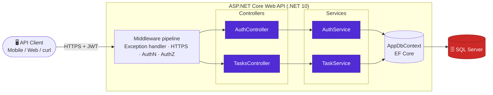
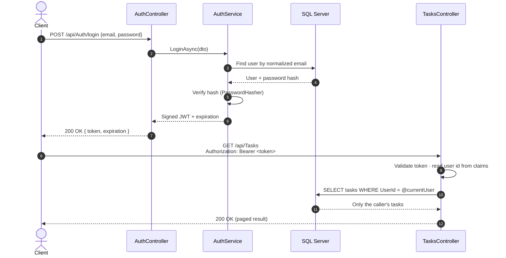
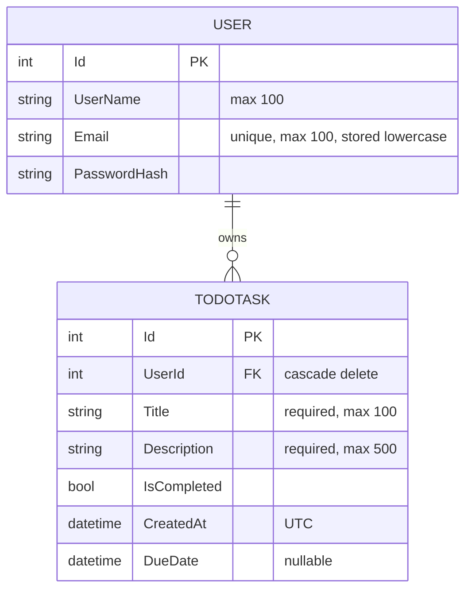

<div align="center">


<br/>

[](https://github.com/mohammedhany4213-create/TodoTaskApi/actions/workflows/dotnet-ci.yml)
[](https://dotnet.microsoft.com/)
[](https://learn.microsoft.com/aspnet/core)
[](https://learn.microsoft.com/ef/core/)
[](https://www.microsoft.com/sql-server)
[](https://jwt.io/)
[](https://xunit.net/)
[](LICENSE)
[](#-contributing)

**A production-minded backend REST API for personal task management — JWT authentication, strict per-user data isolation, pagination, validation, and a clean service-layer architecture.**

[Quick Start](#-quick-start) · [Architecture](#-architecture) · [API Reference](#-api-reference) · [Security](#-security-design) · [Roadmap](#-roadmap)

</div>

---

## ✨ Highlights

| | |
|---|---|
| 🔐 **Secure by default** | JWT bearer auth with full validation (issuer, audience, lifetime, signing key) and ASP.NET Core `PasswordHasher` with automatic rehash on login. |
| 🧱 **Layered architecture** | Controllers → Services → EF Core. Interfaces for every service, DTOs at the boundary, no entities leaking to clients. |
| 🛡️ **Tenant isolation** | Every task query is scoped by the authenticated user's id. Accessing someone else's task returns `404`, never their data. |
| 📄 **Built-in pagination** | `pageNumber` / `pageSize` with enforced limits and rich metadata (`totalPages`, `hasNextPage`, …). |
| 🚨 **Centralized error handling** | One exception handler maps domain exceptions to clean JSON (`401`, `409`, `500`) — no stack traces in responses. |
| 🧪 **Tested business logic** | xUnit suites for both services, including cross-user access scenarios. |
| ⚙️ **CI included** | GitHub Actions restores, builds, and tests on every push and pull request. |

---

## 🏗 Architecture



### Authentication flow



### Data model



---

## 🎯 Project Scope

This repository intentionally contains the **backend only**. A frontend is not part of the project scope; the API is designed to be consumed by any HTTP client.

## 🧰 Tech Stack

| Layer | Technology |
|---|---|
| Runtime / Framework | .NET 10 · ASP.NET Core Web API |
| Data access | Entity Framework Core (code-first migrations) |
| Database | Microsoft SQL Server |
| Authentication | JWT Bearer · `PasswordHasher<User>` |
| API docs | Built-in OpenAPI (Development) |
| Testing | xUnit · EF Core InMemory provider · service & API integration tests |
| CI | GitHub Actions |

---

## 📁 Project Structure

```text
TodoTaskApi/
├── .github/workflows/
│   └── dotnet-ci.yml            # Restore → Build → Test
├── docs/assets/
│   └── banner.svg
├── server/                      # ASP.NET Core Web API
│   ├── Controllers/             # HTTP layer: Auth, Tasks
│   ├── DTOs/                    # Request/response contracts (Auth, Tasks)
│   ├── Data/                    # AppDbContext & entity configuration
│   ├── Exceptions/              # Domain exceptions (ConflictException)
│   ├── Migrations/              # EF Core code-first migrations
│   ├── Models/                  # Entities: User, TodoTask
│   ├── Services/                # Business logic + Interfaces/
│   ├── Program.cs               # Composition root & middleware pipeline
│   └── TodoApi.csproj
├── tests/
│   └── TodoApi.Tests/           # xUnit tests for Auth & Task services
├── TodoTaskApi.sln
├── LICENSE
└── README.md
```

---

## 🚀 Quick Start

### Prerequisites

- [.NET 10 SDK](https://dotnet.microsoft.com/download)
- SQL Server (LocalDB, SQL Server Express, or Docker)
- `dotnet-ef` tool: `dotnet tool install --global dotnet-ef`

### 1. Clone

```bash
git clone https://github.com/mohammedhany4213-create/TodoTaskApi.git
cd TodoTaskApi/server
```

### 2. Start a database

Use an existing SQL Server instance, **or** spin one up with Docker:

```bash
docker run -d --name todo-sql \
  -e "ACCEPT_EULA=Y" \
  -e "MSSQL_SA_PASSWORD=Your_strong_Passw0rd!" \
  -p 1433:1433 \
  mcr.microsoft.com/mssql/server:2022-latest
```

### 3. Configure secrets

Secrets never go in source control. Use [.NET User Secrets](https://learn.microsoft.com/aspnet/core/security/app-secrets) locally:

```bash
dotnet user-secrets set "Jwt:Key" "replace-with-a-random-string-of-at-least-32-characters"

# Only if you are not using the default SQL Express instance in appsettings.json:
dotnet user-secrets set "ConnectionStrings:DefaultConnection" \
  "Server=localhost,1433;Database=TodoDb;User Id=sa;Password=Your_strong_Passw0rd!;TrustServerCertificate=True;"
```

| Key | Description | Default |
|---|---|---|
| `ConnectionStrings:DefaultConnection` | SQL Server connection string | `.\SQLEXPRESS` (Windows auth) |
| `Jwt:Key` | HMAC signing key, **≥ 32 bytes** (app refuses to start otherwise) | *none — required* |
| `Jwt:Issuer` | Token issuer | `TodoApi` |
| `Jwt:Audience` | Token audience | `TodoApiUsers` |
| `Jwt:DurationInMinutes` | Token lifetime | `60` |

### 4. Apply migrations & run

```bash
dotnet ef database update
dotnet run --launch-profile https
```

The API listens on `https://localhost:7184` (and `http://localhost:5216`). In Development, the OpenAPI document is served at `/openapi/v1.json`.

### 5. Try it

```bash
# Register
curl -k -X POST https://localhost:7184/api/Auth/register \
  -H "Content-Type: application/json" \
  -d '{"userName":"mooo","email":"mooo@example.com","password":"S3cure!Passw0rd"}'

# Use the returned token
TOKEN="<paste token here>"

# Create a task
curl -k -X POST https://localhost:7184/api/Tasks \
  -H "Authorization: Bearer $TOKEN" \
  -H "Content-Type: application/json" \
  -d '{"title":"Ship the README","description":"Make it look great","dueDate":"2030-01-01T09:00:00Z"}'

# List tasks (paged)
curl -k "https://localhost:7184/api/Tasks?pageNumber=1&pageSize=10" \
  -H "Authorization: Bearer $TOKEN"
```

### Run the tests

```bash
dotnet test tests/TodoApi.Tests/TodoApi.Tests.csproj
```

---

## 📡 API Reference

Base path: `/api` · Content type: `application/json`

### Authentication

| Method | Endpoint | Auth | Description | Success | Errors |
|:---:|---|:---:|---|:---:|---|
| `POST` | `/Auth/register` | — | Create an account and receive a JWT | `200` | `400` validation · `409` email exists |
| `POST` | `/Auth/login` | — | Exchange credentials for a JWT | `200` | `400` validation · `401` invalid credentials |

**Register body**

```json
{
  "userName": "mooo",
  "email": "mooo@example.com",
  "password": "at-least-8-characters"
}
```

**Auth response**

```json
{
  "token": "eyJhbGciOiJIUzI1NiIs...",
  "expiration": "2030-01-01T10:00:00Z"
}
```

### Tasks &nbsp;🔒 *requires `Authorization: Bearer <token>`*

| Method | Endpoint | Description | Success | Errors |
|:---:|---|---|:---:|---|
| `GET` | `/Tasks?pageNumber=1&pageSize=20` | List your tasks, newest first | `200` | `400` bad paging · `401` |
| `GET` | `/Tasks/{id}` | Get one of your tasks | `200` | `401` · `404` |
| `POST` | `/Tasks` | Create a task | `201` + `Location` | `400` · `401` |
| `PUT` | `/Tasks/{id}` | Update a task | `204` | `400` · `401` · `404` |
| `DELETE` | `/Tasks/{id}` | Delete a task | `204` | `401` · `404` |

**Validation rules**

| Field | Rule |
|---|---|
| `title` | required, ≤ 100 chars |
| `description` | required, ≤ 500 chars |
| `dueDate` | optional; a new task cannot have a due date in the past |
| `pageSize` | 1 – 100 (default 20) |
| `password` | 8 – 128 chars |

**Paged response**

```json
{
  "items": [
    {
      "id": 42,
      "title": "Ship the README",
      "description": "Make it look great",
      "isCompleted": false,
      "createdAt": "2030-01-01T08:00:00Z",
      "dueDate": "2030-01-01T09:00:00Z"
    }
  ],
  "pageNumber": 1,
  "pageSize": 20,
  "totalCount": 1,
  "totalPages": 1,
  "hasNextPage": false,
  "hasPreviousPage": false
}
```

**Error shape**

Errors use RFC 7807-style Problem Details:

```json
{
  "type": "about:blank",
  "title": "Request failed.",
  "status": 409,
  "detail": "Email already exists."
}
```

---

## 🔒 Security Design

| Concern | Approach |
|---|---|
| **Password storage** | ASP.NET Core `PasswordHasher<User>` (salted, iterated hashing); hashes are transparently upgraded on login when the algorithm changes. |
| **Token validation** | Issuer, audience, lifetime, and signature are all validated with a 30-second clock skew. |
| **Secret handling** | No signing key in the repo. The app fails fast at startup if the key is missing or shorter than 32 bytes. |
| **Data isolation** | All task reads/writes filter on the caller's `UserId` from the token claims. Foreign ids are indistinguishable from missing ones (`404`). |
| **Email uniqueness** | Emails are normalized (trim + lowercase) and protected by a unique database index; races are caught and returned as `409`. |
| **Error surface** | Unhandled exceptions return a generic message; internals are never exposed to the client. |
| **Transport** | HTTPS redirection enabled; authentication and authorization enforced on protected endpoints. |

---

## 🗺 Roadmap

### Current scope

- JWT authentication with password hashing
- Per-user task isolation
- Pagination and request validation
- EF Core migrations for SQL Server
- Service-layer unit tests
- GitHub Actions CI

### Future improvements

- [ ] Refresh tokens & token revocation
- [ ] Rate limiting on `/Auth/*`
- [ ] Filtering & sorting (`isCompleted`, due date ranges, search)
- [ ] Dockerfile + `docker-compose` (API + SQL Server)
- [ ] Health checks

---

## 🤝 Contributing

1. Fork the repository and create a feature branch: `git checkout -b feature/amazing-idea`
2. Keep changes focused and add tests for new behavior
3. Make sure `dotnet test` passes
4. Open a pull request describing *what* and *why*

---

## 📜 License

Distributed under the **MIT License**. See [`LICENSE`](LICENSE) for details.

<div align="center">

Built with ☕ and ASP.NET Core by [Eng Mohamed Hany](https://github.com/mohammedhany4213-create)

</div>
